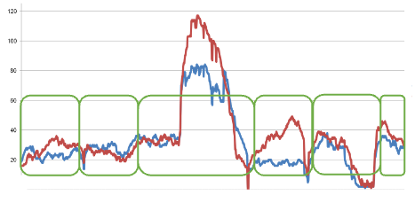
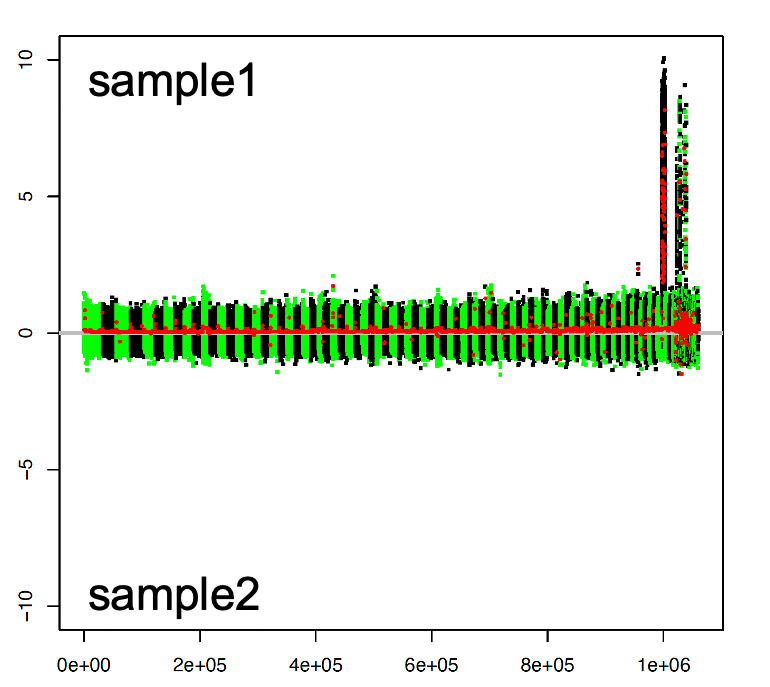

## _Description_

The _DifCover_ pipeline aims to identify regions in a reference genome for which the read coverage of one sample (sample1) is significantly different from the read coverage of another sample (sample2) when aligned to a common reference genome. “Significantly different” is determined by user-defined thresholds. The pipeline allows exclusion of regions from consideration based on read coverage. These include regions with low sequence coverage in both samples (regions that are undersampled due to nucleotide content) and regions with exceedingly high sequence coverage (i.e. repetitive sequences). Both cases can be misleading with respect to coverage analyses. The DifCover pipeline is specifically oriented to the analysis of large genomes and can handle very fragmented assemblies. 

### ------------------------------------------------------------------------

## _Method_
The alignment of short reads to a reference genome can be characterized by the depth of coverage computed for each genomic position as number of reads mapped over it. Fluctuations of coverage can often yield variable coverage ratios and may interfere with the identification of regions that differ between samples. In many cases, calculating average coverage ratios over windows can more accurately reflect differences in copy number of the underlying fragments. In practice, the locations and sizes of the windows can be defined in a various ways. Traditional tools already offer solutions that allow computing average coverage over intervals of a fixed size (sambamba) or splitting contig into separate intervals consisting of bases with the same coverage (bedtools). However these tools are not, in and of themselves, well suited in practice for the analysis of large complex genomes with large numbers of gaps and repeats. DifCover addresses these issues by introducing the notion of window “stretching”. Essentially each genomic scaffold is scanned sequentially to form windows of variable size, but with predefined number of bases that have coverage within user-defined limits. These stretched windows allow bridging across under- and over-represented fragments permitting more precise analyses. For each window an average coverage is reported and compared to the coverage of another sample. For highly contiguous genomes, adjacent windows with similar coverage ratios can be combined to generate consensus estimates for larger continuous regions. Finally regions with significant difference in coverage can be extracted for downstream analyses.

=====================================================

## _USAGE_
### Prerequisites (MUST be in your PATH)
	BEDTOOLS
	SAMTOOLS 
	AWK
	DNAcopy (for R) // optional (see NOTE 5 for stage 3) (https://bioconductor.org/packages/release/bioc/html/DNAcopy.html)

### Quick start
The DifCover pipeline includes several bash scripts and one C++ program. They can be run separately stage by stage, to experiment with parameters, or run in a bulk from run_difcover.sh with predefined in it parameters. This section gives an example on how to run entire pipeline.

INPUT: two coordinate sorted BAM files presenting read alignments (mostly tested on short reads, but can work on long reads too) from two samples to the same reference

OUTPUT: *.DNAcopyout.up{p} file with regions of significant coverage difference (p-fragments).  Format details can be found in the next section.

Download DifCover

cd DifCover/dif_cover_scripts/
chmod +x *sh		#make bash scripts executable
make

Copy DifCover/dif_cover_scripts/run_difcover.sh to the directory with BAM files and replace parameters with your values

	FOLDER_PATH='path to dif_cover_scripts/ directory'
	BAM1='path to sample1.bam'
	BAM2='path to sample2.bam'
	a=10		# minimum coverage for sample1
	A=219		# maximum coverage for sample1
	b=10		# minimum coverage for sample2
	B=240		# maximum coverage for sample2
	v=1000	        # target number of valid bases in stretched windows
	l=500		# minimum size of window to output
	AC=1.095	# Adjustment Coefficient (set AC to 1, if modal coverage is equal) 
	p=2		# enrichment scores threshold (for p=2 will report regions with coverage in sample1 being roughly 4 times larger than coverage in sample2)
	bin=1		# for an auxiliary analytical stage (5); generates enrichment scores histogram with scores in bins with floating precision 1. For more detailed histogram use 10, 100.

Run entire pipeline
./run_difcover.sh

## Citation

Nataliya Timoshevskaya, Kaan İ. Eşkut, Vladimir A. Timoshevskiy, Sofia M. C. Robb, Carson Holt, Jon E. Hess, Hugo J. Parker, Cindy F. Baker, Allison K. Miller, Cody Saraceno , Mark Yandell, Robb Krumlauf, Shawn R. Narum, Ralph Lampman, Neil J. Gemmell, Jacquelyn Mountcastle, Bettina Haase, Jennifer R. Balacco, Giulio Formenti, Sarah Pelan, Ying Sims, Kerstin Howe, Olivier Fedrigo , Erich D. Jarvis, Jeramiah J. Smith (2023). "An improved sea lamprey (_Petromyzon marinus_) germline genome assembly illuminates the evolution of germline-specific chromosomes." In review

Smith, J. J., N. Timoshevskaya, C. Ye, C. Holt, M. C. Keinath, H. J. Parker, M. E. Cook, J. E. Hess, S. R. Narum, F. Lamanna, H. Kaessmann, V. A. Timoshevskiy, C. K. M. Waterbury, C. Saraceno, L. M. Wiedemann, S. M. C. Robb, C. Baker, E. E. Eichler, D. Hockman, T. Sauka-Spengler, M. Yandell, R. Krumlauf, G. Elgar and C. T. Amemiya (2018). "The sea lamprey germline genome provides insights into programmed genome rearrangement and vertebrate evolution." Nat Genet 50(2): 270-277.

## Pipeline overview and stage by stage usage example
The DifCover pipeline includes several bash scripts and one C++ program. They can be run separately stage by stage, to experiment with parameters, or run in a bulk from run_difcover.sh with predefined in it parameters.

INPUT: coordinate sorted files in BAM format for two samples and mandatory parameters (explained for each stage below) 

OUTPUT:  *.DNAcopyout.up{p} file with regions of significant coverage difference (p-fragments). Intermediate files (explained for each stage below).

    <<  sample1.bam, sample2.bam, a, A, b, B, v, l, AC, p >>

		        \/

    (1)  from_bams_to_unionbed.sh  (sample1.bam, sample2.bam)

	    	        \/

    (2)  from_unionbed_to_ratio_per_window (a, A, b, B, v, l)

	    	        \/

    (3)  from_ratio_per_window__to__DNAcopy_output.sh (AC)

	    	        \/

    (4)  from_DNAcopyout_to_p_fragments.sh (p)

	    	        \/

           << p-fragments >>

## Stage by stage usage example
### Prepare input data

    cd DifCover
    chmod +x *sh
    cp ./dif_cover_scripts/run_difcover.sh test_data/
    cd test_data/

Open run_difcover.sh in text editor. Set FOLDER_PATH to a path to the dif_cover_scripts/

FOLDER_PATH=../dif_cover_scripts

### run stage (1)
$FOLDER_PATH/from_bams_to_unionbed.sh sample1.bam sample2.bam

OUPUT: 
* sample1_sample2.unionbedcv
* ref.length.Vk1s_sorted //keep it for following stages

NOTES: This script calls different functions from BEDTOOLS. File sample1_sample2.unionbedcv stores coverage information from both samples, allowing coverage comparisons between them.

### run stage (2)
$FOLDER_PATH/from_unionbed_to_ratio_per_window_CC0 sample1_sample2.unionbedcv 10 219 10 240 1000 500

	a=10 		minimum coverage for sample1
	A=219		maximum coverage for sample1
	b=10		minimum coverage for sample2
	B=240		maximum coverage for sample2
	v=1000 	        target number of valid bases in the window
	l=500		minimum size of window to output (window includes valid and non valid bases)

OUTPUT: 
* sample1_sample2.ratio_per_w_CC0_a10_A219_b10_B240_v1000_l500 

In sample1_sample2.ratio_per_w_CC0_a10_A219_b10_B240_v1000_l500 columns are: scaffold, window_start, size_of_window, number_of_valid_bases_in_window, Q1, Q2, R.

NOTES:
1. The program will merge bed intervals constructing stretched windows with v valid bases.

2. For C1 and C2 being coverage values for sample1 and sample2 respectfully valid bases must satisfy _**both**_ of the following conditions  

		1) C1 < A and C2 < B;

		2) C1 > a or C2 > b.
3.  Each window has approximately v valid bases, but because window is formed from bed intervals it can have
	- fewer than _v_ bases – in a case if the window hits the end of the scaffold
	- more than _v_ bases – to avoid breaking of the last added bed interval
4. For each window the program computes

	Q1 – average coverage of valid bases across all merged bed intervals for sample1  

	Q2 – average coverage of valid bases across all merged bed intervals for sample2

	if Q2=0, than R=Q1/CC0; else R = Q1/Q2.

	If coverage of sample2 is zero for a given window, the program employs a conservative continuity correction to prevent division by zero, replacing zero values with an arbitrary small value CC0 corresponding to alignment of 0.5 reads over the interval. CC0 is a predefined constant, but we may update this parameter in the future.      

### run stage (3)
$FOLDER_PATH/from_ratio_per_window__to__DNAcopy_output.sh sample1_sample2.ratio_per_w_CC0_a10_A219_b10_B240_v1000_l500 1.095

OUTPUT: 
* sample1_sample2.ratio_per_w_CC0_a10_A219_b10_B240_v1000_l500.log2adj_1.095
* sample1_sample2.ratio_per_w_CC0_a10_A219_b10_B240_v1000_l500.log2adj_1.095.pdf
* sample1_sample2.ratio_per_w_CC0_a10_A219_b10_B240_v1000_l500.log2adj_1.095.DNAcopyout

In *.DNAcopyout columns are: scaffold, start position of first window in the interval, start position of last window in the interval, number of merged windows, enrichment score

NOTES:
1. AC = 1.095 is an Adjustment Coefficient that allows to take in an account initial difference in the amount of sampling or produced coverage for each sample. We recommend compute AC as ratio (modal coverage of sample2)/(modal coverage of sample1). Modal coverage for each sample can be calculated using generated with samtools stats histogram for per base coverage (samtools stats sample1.bam | grep). 
2. First, the enrichment score log2[AC*R] is calculated for each window. Second, DNAcopy merges windows with similar enrichment scores (see details in DNAcopy description https://www.bioconductor.org/packages/devel/bioc/vignettes/DNAcopy/inst/doc/DNAcopy.pdf) to larger intervals and calculates a final score for each interval. 
3. DNAcopy may require long run times to generate results for large genomes. To reduce time one can decrease number of windows by increasing size of windows (v) on stage 2.
4. Alternatively, input files can be split and processed in parallel, although this may change results slightly, because DNAcopy considers the distribution of enrichment stats across all windows when implementing its segmentation algorithm.
5. If number of windows is not large or if most scaffolds are covered by a relatively small number of windows, one can directly proceed to filtering or analysis of *.log2adj_1.095 file (with columns: scaffold, window_start, enrichment_score) without running DNAcopy.
6. This stage generates a *.pdf file that provides visualization of the distribution of enrichment scores and can be helpful in the choice of threshold p for stage 4. Each dot on the plot corresponds to a window. Different scaffolds are represented by alternated groups of green and black dots. Red lines show an average enrichment scores accross merged adjacent windows. Positive scores correspond to enrichment in sample1 compare to sample2, and negative to enrichment in sample2 compare to sample1.

### -------------------------------------  -----------------------------------

### run stage (4)

Filter only genomic regions with enrichment scores > p.

$FOLDER_PATH/from_DNAcopyout_to_p_fragments.sh 

sample1_sample2.unionbedcv.ratio_per_w_a2_A48_b2_B54_v1000_l500.log2adj_1.166.DNAcopyout 2

OUTPUT:
* sample1_sample2.ratio_per_w_CC0_a10_A219_b10_B240_v1000_l500.log2adj_1.095.DNAcopyout.up2
* sample1_sample2.ratio_per_w_CC0_a10_A219_b10_B240_v1000_l500.log2adj_1.095.DNAcopyout.down-2
	
NOTES:
1. The script extracts from file *.DNAcopyout fragments with enrichment scores ≥ p and stores them in *.DNAcopyout{p}, (i.e. fragments where read coverage in sample1 is higher than sample2 ), and *.DNAcopyout.down{-p} fragments with enrichment scores ≤-p, (i.e. fragments where coverage in sample2 is higher than sample1 ).

## _Methodological Details_
DifCover works by comparing average depth of coverage across continuous intervals containing approximately v valid bases. The valid bases are determined by user defined lower and upper limits on depth of coverage for sample1 and sample2, defined respectively by a, A for sample1, and b, B for sample2. Some bases with coverage C1 and C2 are considered to be valid if 1) C1 < A and C2 < B; and also 2) C1 > a or C2 > b.  These upper limits allow identification and masking of segments that contain repeats, while lower limits serve to exclude underrepresented segments – gaps and fragments that are undersampled due to technical bias). In general, we recommend setting upper and lower limits after examining the distribution of read coverages and considering the degree to which the analysis is meant to reflect single-copy vs repetitive sequences. For identification of coverage differences that are focused on characterization of single/low-copy regions we typically assign lower coverage limits to one third of modal coverage and upper limits to 3X of modal coverage.  
The recruitment of valid bases into windows is done by traversing scaffolds from beginning to end. After the number of valid bases in a window reaches v, the window is closed and analysed. If the end of a scaffold is reached before v valid bases are recruited into the current window, the window is retained only if its size is ≥ _l_. This approach provides flexibility for balancing between coarse granularity for large scaffolds while permitting the incorporation of short scaffolds of _l_ < size < _v_, which can be particularly useful for analysis of highly fragmented assemblies. 
